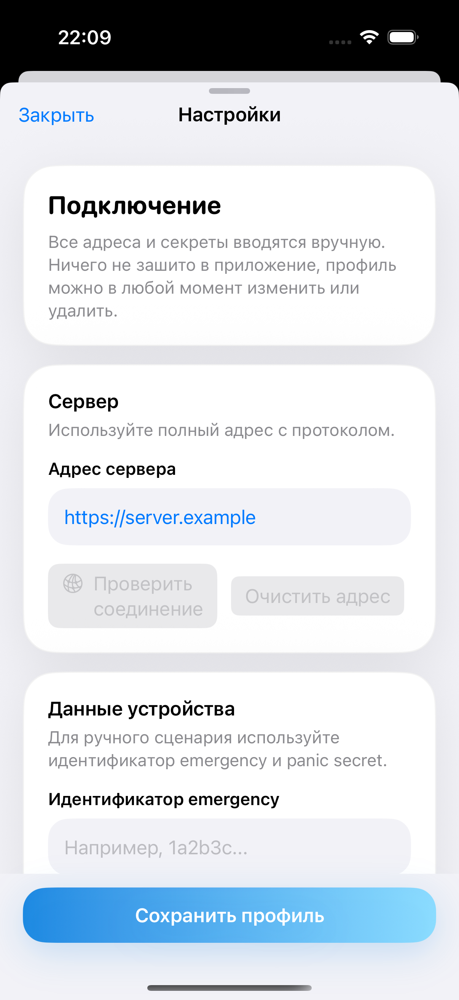
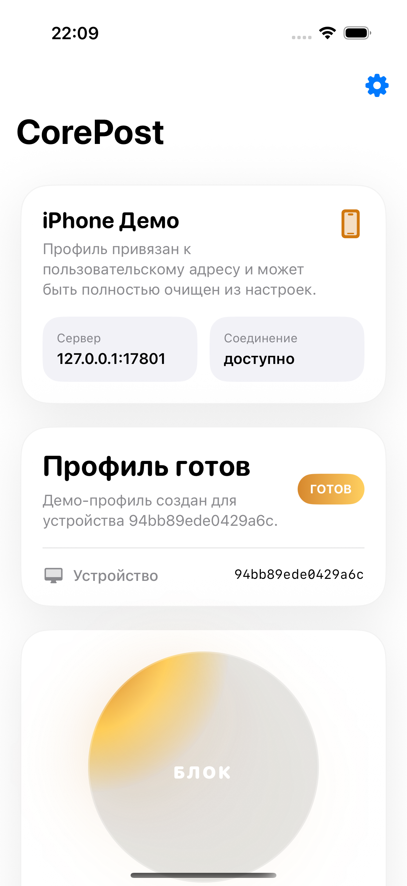
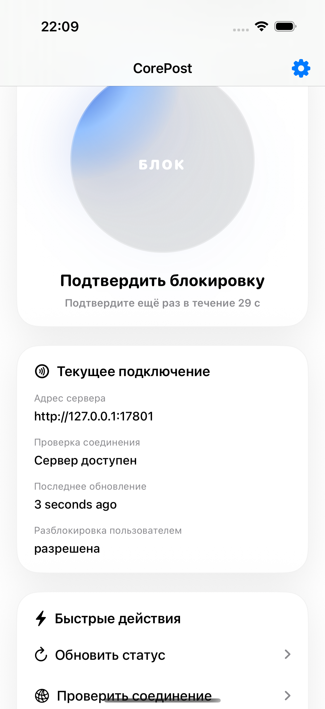
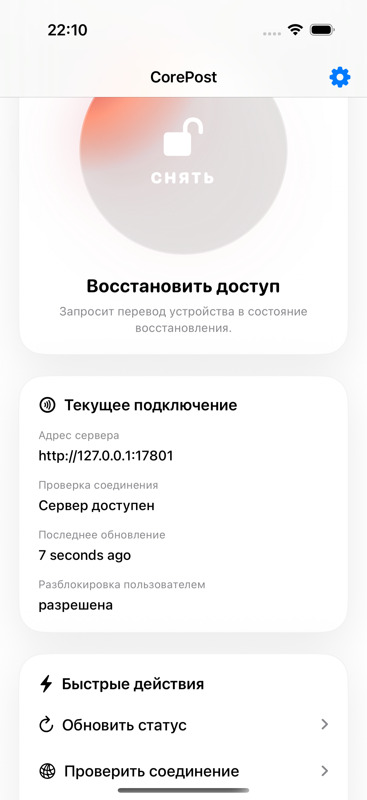
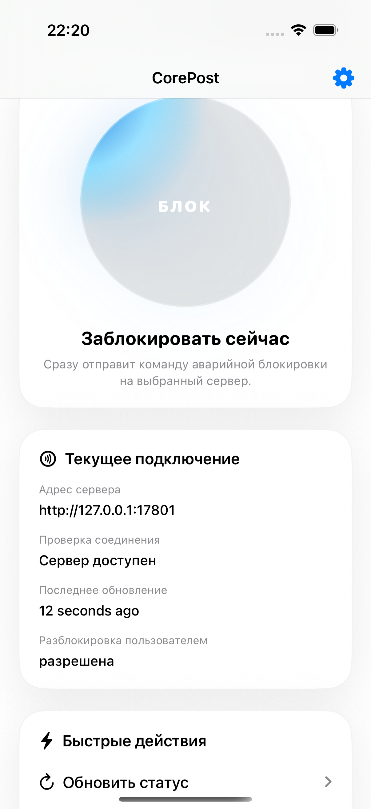

# CorePost iOS

Нативный iPhone-клиент на SwiftUI для мобильного сценария CorePost.

## О репозитории

Репозиторий содержит iOS-приложение, которое подключается к серверу, заданному пользователем, хранит локальные секреты и предоставляет мобильный сценарий проверки статуса, блокировки и восстановления доступа.

В составе репозитория:

- SwiftUI-интерфейс под iPhone с русской локализацией основных экранов
- слой конфигурации с ручным вводом, изменением и очисткой адреса сервера
- локальное хранение чувствительных данных через `UserDefaults` и Keychain
- сетевой слой с конфигурируемым адресом сервера и подписанными запросами
- UI-тесты для проверки ключевого пользовательского сценария

## Возможности

- адрес сервера вводится пользователем, его можно изменить или удалить
- `emergencyId`, `panic secret` и административный токен хранятся отдельно от обычных настроек
- доступны проверка соединения, создание профиля устройства, блокировка, подтверждение блокировки и восстановление доступа
- проект собирается через `xcodegen`, Xcode и `xcodebuild`

## Сборка

```bash
xcodegen generate
xcodebuild \
  -project CorePostMobileIOS.xcodeproj \
  -scheme CorePostMobileIOS \
  -destination 'platform=iOS Simulator,name=iPhone 16 Pro' \
  build
```

## Артефакты demo

Видео и скриншоты сняты вручную на iOS Simulator и добавлены как демонстрация текущего состояния клиента.

Видео:

- `docs/demo/video/corepost-ios-demo.mp4`

Скриншоты:








## Release flow

1. Собрать архив в Xcode или через `xcodebuild archive`.
2. Экспортировать `.ipa` с локальными настройками подписи.
3. Загрузить `.ipa` в GitHub Releases.

Локальные build-артефакты и временные каталоги не являются частью репозитория. В проекте нет зашитого серверного адреса: приложение работает только с адресом, который ввёл пользователь.
